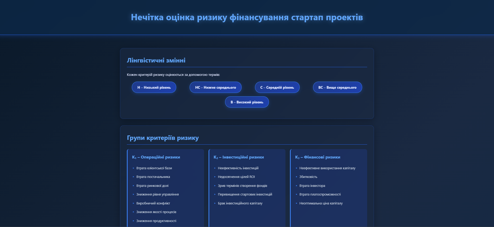

# Нечітка оцінка ризику фінансування стартап проектів

Веб-додаток для оцінювання ризиків комерційних та стартап проектів на основі нечіткої математичної моделі.



## 📋 Опис проекту

Цей проект реалізує дворівневу математичну модель оцінювання ризиків проектів, яка базується на лінгвістичних змінних та експертних оцінках. Система аналізує чотири групи критеріїв ризику та визначає загальний рівень безпеки фінансування проекту.

## ✨ Основні функції

- **Інтерактивний калькулятор ризиків** - введення оцінок по 4 групах критеріїв
- **Візуалізація груп ризиків**:
  - Операційні ризики (K₁)
  - Інвестиційні ризики (K₂)
  - Фінансові ризики (K₃)
  - Ризики інноваційної діяльності (K₄)
- **Автоматичний розрахунок** агрегованої оцінки ризику
- **Лінгвістичне трактування** результатів (5 рівнів безпеки)
- **Адаптивний дизайн** для всіх пристроїв

## 🎨 Дизайн

- Темно-синя кольорова палітра
- Glassmorphism ефекти
- Плавні анімації та переходи
- Сучасний UI/UX

## 🚀 Швидкий старт

### Встановлення

```
/
│
├── index.html          # Головна HTML-сторінка
├── style.css           # Стилі додатку
├── script.js           # JavaScript логіка калькулятора
└── README.md           # Документація проекту
```

## 📊 Методологія оцінювання

### Лінгвістичні змінні

- **Н** - Низький рівень ризику
- **НС** - Рівень ризику нижче середнього
- **С** - Середній рівень ризику
- **ВС** - Рівень ризику вище середнього
- **В** - Високий рівень ризику

### Рівні безпеки фінансування

| Оцінка       | Рівень    | Опис                              |
| ------------ | --------- | --------------------------------- |
| [0; 0.21]    | Незначний | Дуже низький рівень ризику        |
| (0.21; 0.36] | Низький   | Рекомендується до фінансування    |
| (0.36; 0.67] | Середній  | Потрібен детальний аналіз         |
| (0.67; 0.87] | Високий   | Фінансування потребує обережності |
| (0.87; 1]    | Граничний | Критичний рівень ризику           |

## 💻 Використання

1. Виберіть рівень ризику для кожної з 4 груп критеріїв
2. Встановіть достовірність оцінки (0-1) для кожної групи
3. Натисніть кнопку "Розрахувати ризик"
4. Отримайте агреговану оцінку та рекомендації

### Приклад використання

```javascript
// Приклад вхідних даних:
K₁ (Операційні): Н (Низький) - Достовірність: 0.75
K₂ (Інвестиційні): НС (Нижче середнього) - Достовірність: 0.8
K₃ (Фінансові): НС (Нижче середнього) - Достовірність: 0.37
K₄ (Інноваційні): НС (Нижче середнього) - Достовірність: 0.47

// Результат: R = 0.2847 (Середній ступінь ризику)
```

## 🛠️ Технології

- HTML5
- CSS3 (Flexbox, Grid, Animations)
- Vanilla JavaScript (ES6+)
- Responsive Design

## 📱 Сумісність

- ✅ Chrome (рекомендовано)
- ✅ Firefox
- ✅ Safari
- ✅ Edge
- ✅ Мобільні браузери (iOS/Android)

## 📖 Теоретична база

Проект базується на методології нечіткої оцінки ризиків, описаній у навчальних матеріалах "Тема 7. Нечітка оцінка ризику фінансування стартап проектів".

### Математична модель

```
R = F(P₁, P₂, P₃) → Y
```

де:

- **P₁** - оцінка походження проекту
- **P₂** - оцінка галузі економіки
- **P₃** - агрегована оцінка ризику реалізації
- **Y** - вихідна лінгвістична оцінка

---
